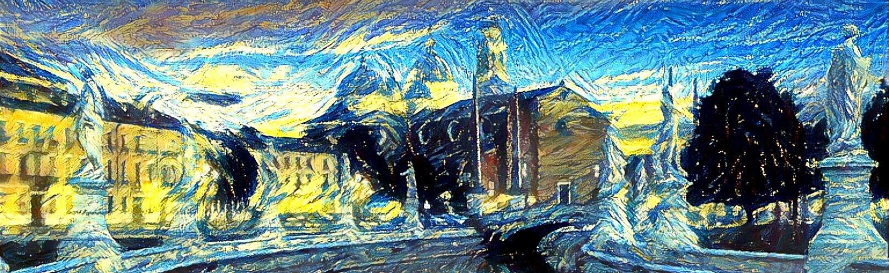
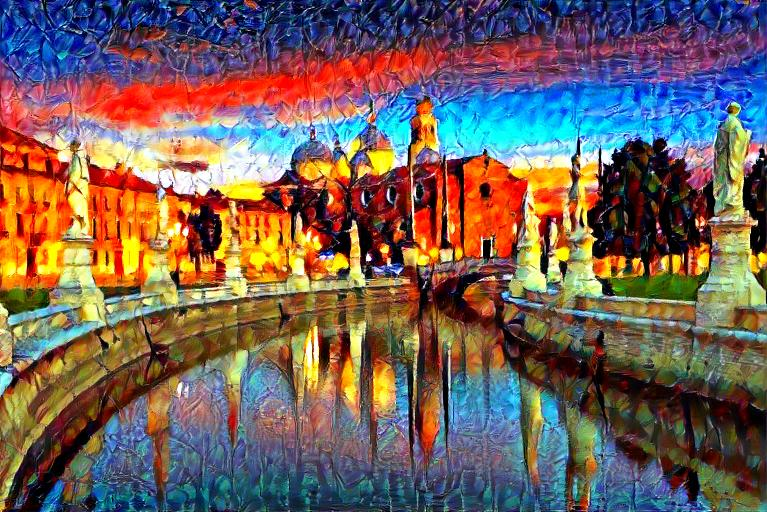
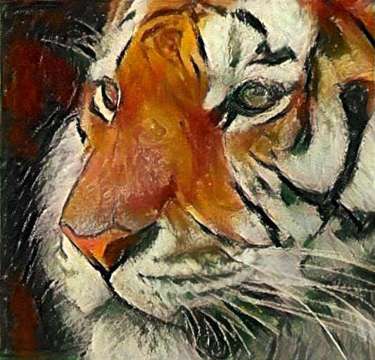
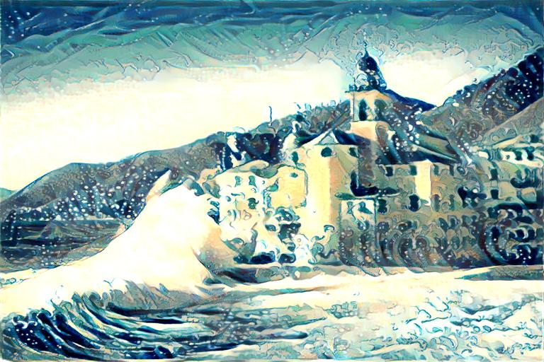
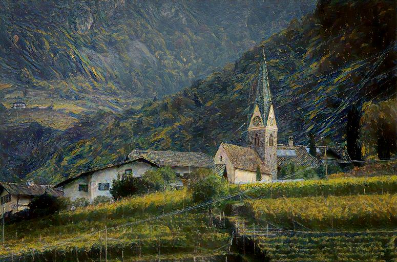

# Image style transfer using deep learning

<p align="center">
<b>Group members</b> // Francesco Pio Barone, Daniele Ninni, Paolo Zinesi
</p>

<p align='center'>
  
</p>

<p align='center'>
  
  
  
  
</p>

## Inside this repo

* `gatys.py` - This script is the final version of our implementation of *Gatys et al.* (2016). It is meant to be executed by command-line only.
  - `gatys.ipynb` - Includes all the functionalities of the .py script, but embedded in a readable notebook to show the use of our custom library (deepstyle) which collects all the functions required by this NST algorithm.
  - `gatys_nolib.ipynb` - The notebook provides an overview of Gatys' algorithm without making use of our library (deepstyle).

* `huang_test.ipynb` - The model presented in *Huang et al.* (2017), implemented inside a notebook. This model makes use of the .pth files in `models/`.
  - `huang_train.ipynb` - This notebook is used to train the decoder network.

<br>

## Setup

We recommend the use of PyTorch (>= 1.14.0). To install the required dependencies, please run
```bash
pip install -r requirements.txt
```

### How to **run Gatys NST**

The Gatys model is provided with a .py script:
```bash
python3 gatys.py -output example.jpg -iterations 600 \
    -content-weight 1e1 \
    -style image/starry-night.jpg \
    -content image/bolzano.jpg \
    -color-control hist
```

Some options include:
* `output` - the output style image to be written
* `style` and `content` - the images to be used as style and content features, respectively
* `color-control` - choose a color control option among `none`, `luminance`, `hist`, `hist_from_style` (default: none)
* `content-weight` - set the content weight (float) (default: 1e0)
* `iterations` - set the number of iterations to execute (default: 400)
* `image-size` - set the short-edge image resolution to be generated (default: 512)
* `high-res` - set any value greater than `image-size` to enable the upscaling to higher resolution (default: none)

### How to **run Huang NST**

The Huang algorithm is presented as Jupyter notebooks: `huang_test.ipynb` and `huang_train.ipynb`. Look inside the notebooks for further instructions.

***

## Bibliography

- L. A. Gatys, A. S. Ecker and M. Bethge, *Image Style Transfer Using Convolutional Neural Networks*, 2016 IEEE Conference on Computer Vision and Pattern Recognition (CVPR), 2016, pp. 2414-2423
- L. A. Gatys, M. Bethge, A. Hertzmann and E. Shechtman, *Preserving Color in Neural Artistic Style Transfer*, arXiv preprint arXiv:1606.05897, 2016
- X. Huang and S. Belongie, *Arbitrary Style Transfer in Real-Time with Adaptive Instance Normalization*, 2017 IEEE International Conference on Computer Vision (ICCV), 2017, pp. 1510-1519

***

<h5 align="center">Neural Networks and Deep Learning<br>University of Padua, A.Y. 2022/23</h5>

<p align="center">
  
</p>